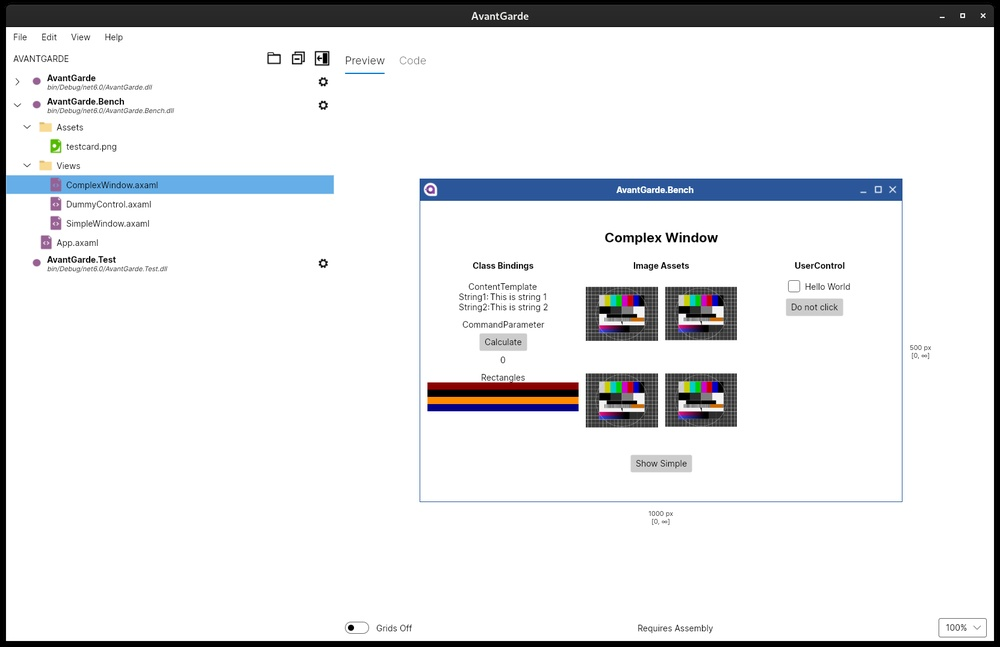

# AvanteGrade #
## Avalonia XAML Previewer ##

This is currently a placeholder for AvantGarde -- an open source Avalonia (.NET) XAML previewer application I'm
currently developing. This previewer, unlike others, is IDE independent. I'm primarily targeting LINUX, as currently
there is no Avalonia previewer available as yet, but it will be cross-platform and support Windows.

Below, a development screenshot:

    

Avalonia is WPF-like GUI framework for .NET, but unlike WPF, it is fully cross-platform.

See: [Avalonia Github page](https://github.com/AvaloniaUI/Avalonia).

KuiperZone January, 2022
