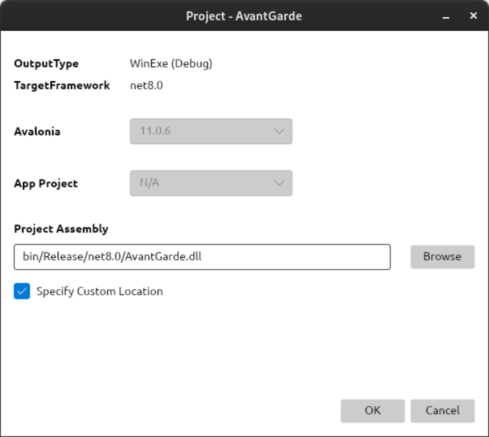

# Avant Garde #

**Avant Garde** is a cross-platform XAML previewer for the C# [Avalonia Framework](https://github.com/AvaloniaUI/Avalonia).
It operates as a standalone application that works with your IDE, rather than an extension to an IDE. This means that
Avant Garde is completely IDE agnostic.

**[DOWNLOAD & INSTALL](https://github.com/kuiperzone/AvantGarde/releases/latest)**

Avant Garde is licensed under GPLv3 or later.

*If you like this project, don't forget to like and share. If you don't like it, best you keep that to yourself. *

**IMPORTANT NOTE:** Avant Garde supports Avalonia XAML (AXAML) with .NET. It cannot be used to preview WPF or MAUI
applications.

## Linux & Windows
[Downloads](https://github.com/kuiperzone/AvantGarde/releases/latest)
include AppImages, deb and RPMs for **Linux**, and a **Setup Installer** for Windows.

### MacOS? ###
Avant Garde is not actively supported or tested on MacOS, although there are reports of it
[working fine](https://github.com/kuiperzone/AvantGarde/discussions/16). However, you will need to clone and build
from source.

## Features

* Avant Garde is a standalone application rather than an extension to an IDE.

* It provides a read-only view of your Avalonia project, watching for file changes.

* Set its main window to stay-on-top, and it will update the moment you save your files from your IDE.

* While Avant Garde looks like a simple IDE and, indeed, can be used to browse your entire project,
the generation of XAML previews is the primary use case. It is not a XAML designer or an editor. It
does not modify your project files or write to your project directories.

* It supports preview scale, mouse interaction and a range of other features, including the ability
to generate and export an Avalonia schema (XSD) file. See below for information.

* Command line arguments provide for integration with IDEs where supported. For example, it is
possible to launch Avant Garde so that a particular AXAML file is selected and shown on opening. It
is also possible to launch it with its built-in **Project Explorer** hidden so as to minimize the
application window foot-print.

* It supports a **dark theme**, so can match your desktop. See the application "Preferences".

## Using Avant Garde

Simply open a *.sln or *.csproj as you would in any IDE.

By the default, only "*.axaml;*.xaml" and image files are shown in the Project Explorer as these are
the primary files you will want to see in Avant Garde. The rest of your project source will not be
shown, but can be enabled (see "Solution Settings" below).

Below, Visual Code on Linux with Avant Garde floating in stay-on-top mode to the right. Note, here,
that the Avant Garde project explorer has been hidden so that only the form preview is shown. This
minimizes the window footprint. The preview will be updated as XAML changes are saved to file from
your IDE.

### Finding Your Assembly
In order to generate previews, Avant Garde must find your application assembly which must first be
built. This is usual practice with XAML previewers. If your assembly is in the usual place, i.e.
under `project/bin/Debug...`, Avant Garde will find it. If, however, if you are using variables or a
`Directory.Build.props` file to set your output location, you will need to specify this location at
the project level (see below).

### Solution Settings
Avant Garde keeps state and settings for each solution or project you open. Solution and project
settings are specific to Avant Garde and, typically, the default values suffice and you will not
need to change them. Any changes you do make, however, are saved by Avant Garde so that such changes
persist between application launches. Note that these settings are stored outside of your project as
Avant Garde does not write to your project directories.

With a solution file open, click `Edit`->`Solution` (or the "cog icon" in the toolbar) to view
solution level settings. As shown below, these apply to your "solution", and all sub-projects
contained within it.

For example, setting "Include File Pattern" to "*" will cause **all project files** to be shown in
the Explorer. Remember, however, that views are read-only and Avant Garde is not intended to be used
as a text editor or IDE.

### Project Settings
Project settings pertain to each project within a solution.

Click `Edit`->`Project`, or the "cog icon" beside the project in the Explorer on the left side.

As described, if your target assembly output cannot be located on disk, this is the place to specify
it, as shown above.

Moreover, if your project is a class library, it will be necessary to specify a relevant application
project before previews can be generated.

Normally, Avant Garde will detect the Avalonia version from your project `.csproj` file. There are
certain instances when your project may not include the Avalonia package directly, but instead
reference another class library which does. In this case, you must set the Avalonia version yourself
which must be installed in your development environment.

### Preview Options
There are a number of options associated with preview generation, as shown by the drop-down button
below:

#### Grid Lines & Colors
The "Grid Lines & Colors" options will cause instances of XAML `Grid` to be high-lighted with lines
and background shade colours.

#### Disable Events
The "Disable Events" option disables mouse interaction with the preview. This may be useful because
it strips out all known Avalonia Control events from the XML prior to preview generation. When
disabled, events can be added and changed in the source code *without* having to re-build the
assembly each time.

#### Prefetch Assets
When checked, the "Prefetch Assets" option will cause Avant Garde to locate asset files (i.e.
images) within your project source rather than the assembly. This, like "Disable Events", means that
assets may be added or updated without having to rebuild on each change.

### Stay-on-top Pin
When working in an IDE, it is sometimes useful to keep Avant Garde on top while minimising the
footprint of the main window. On Linux, both Gnome and KDE provide an "Always on Top" option from
the titlebar.

On other systems, a "pin" button is available to do the same thing in Avant Garde itself. By
default, on Linux, the pin button is hidden* but can be made visible from the Preferences window, as
shown above.

*\* This was done because it is not always possible to align the pin button state with "always on
top" check state shown in the title bar, that and the fact it is not typically needed on Linux.*

### Export Avalonia Schema
As a bonus feature, Avant Garde is able to generate and export an Avalonia schema (XSD) file. The
schema file is generated by querying all Avalonia types, and is specific to the Avalonia version
against which Avant Garde was built.

The exported XSD file may be used with an IDE plugin extension to provide AXAML auto-completion and help reference
hints. Below, Visual Code with the [Xml
Complete](https://marketplace.visualstudio.com/items?itemName=rogalmic.vscode-xml-complete) extension, but referencing
the XSD generated by Avant Garde.

You should find the XSD generated by Avant Garde useful as it provides comprehensive auto-completion and reference
information, rather than a limited number of human generated explanations.

## Command Line Options
Command line options can be utilized to launch Avant Garde from an IDE, as supported.

**Usage:**

    AvantGarde [filename] [-options]

This assumes `AvantGarde` is in the path.

Typically, filename is expected to be .sln or .csproj file. However, it is also possible to launch
AvantGarde with *any file* within the project hierarchy provided there exists a .csproj file in a
parent directory above the file.

**Options:**

    -h, --help
    Show help information.

    -v, --version
    Show version information.

    -m, --min-explorer
    Show with minimized explorer and non-maximized main window.

    -s=name, --select=name
    Select and preview given item on opening. Name can be a leaf name or fully qualified path.

**Examples:**

Below, opens a solution and selects/previews `MainWindow.axaml` immediately on opening.

    AvantGarde ~/MyProject/MyProject.sln --select=MainWindow.axaml

Below, as with the first example, except that the project explorer will also be minimized to the
side of the window.

    AvantGarde ~/MyProject/MyProject.sln --min-explorer -s=MainWindow.axaml

Below, we supply a .axaml file rather than a .sln or .csproj.

    AvantGarde ~/MyProject/Views/MainWindow.axaml

Here, AvantGarde will locate the first .csproj file it finds in the directory structure above the
supplied path level. The result will be similar to the first example above because the
`MainWindow.axaml` preview will be shown on opening so that the "--select" option is not necessary
here.

## Miscellanous

Avant Garde will read the `$DOTNET_HOST_PATH` environment variable to determine the location of
`dotnet`. If this is undefined, `dotnet` is assumed to be in the path.

## Copyright & License

Copyright (C) Andy Thomas, 2022-25
Website: https://github.com/kuiperzone

Avant Garde Previewer for Avalonia is free software: you can redistribute it and/or modify it under
the terms of the GNU General Public License as published by the Free Software Foundation, either
version 3 of the License, or (at your option) any later version.

Avant Garde is distributed in the hope that it will be useful, but WITHOUT ANY WARRANTY; without
even the implied warranty of MERCHANTABILITY or FITNESS FOR A PARTICULAR PURPOSE. See the GNU
General Public License for more details.

### Non-code Assets
Images and non-code assets are not subject to GPL.

Avant Garde Project Logo: Copyright (C) Andy Thomas, 2022.
Button and file icons: Copyright (C) Andy Thomas, 2022.
Josefin Sans: Santiago Orozco, SIL Open Font License, Version 1.1.

All other copyright and trademarks are property of respective owners.
